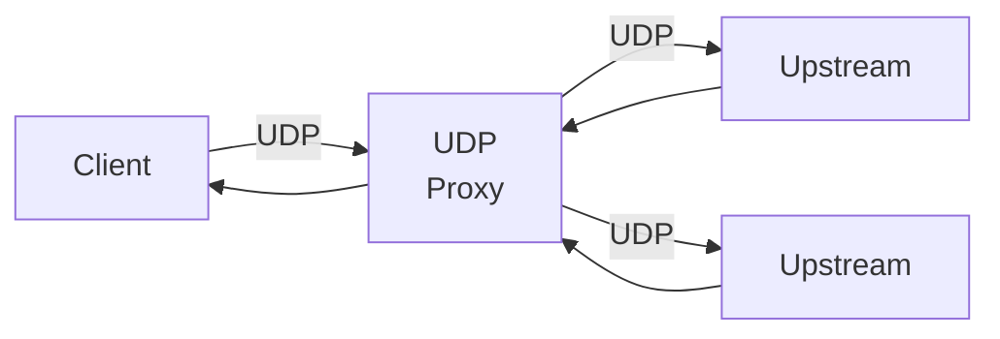
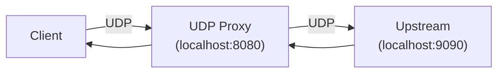

# UDPサーバ・UDPプロキシ

## 概要 {#abstract}

UDPサーバは、UDP(レイヤー4)のサーバを実装することを目的としています。
UDPサーバは、[Goの標準ライブラリ](https://pkg.go.dev/std)では提供されていません。
本機能では[net/httpパッケージ](https://pkg.go.dev/net/http)の[Server](https://pkg.go.dev/net/http#Server)に似たインターフェースでUDPサーバを利用できることを目指しています。

UDPはTCPと異なりコネクションレスのプロトコルです。
そのため、ここで実装されるUDPサーバは仮想コネクションを
仮想コネクション

## 機能 {#features}

UDPサーバが保有する機能は以下の通りです。

### 1. UDPサーバ機能 {#udp-server}

UDPサーバとして、クライアントからパケット（UDPデータグラム）を受け取り、ハンドラーに連携します。
UDPサーバはTLSに対応していません。

性能面の理由から、UDPサーバは内部で仮想コネクションを作成します。
仮想コネクションはクライアントの`IP:Port`に対して１つ作成されます。

サーバの終了処理は以下の２種類があります。

- クローズ
  - `Server.Close`を利用した終了処理
  - 最初にUDP接続の受付を停止（UDPリスナーのクローズ）
  - 続いて既存のUDPの処理ループをキャンセル
- シャットダウン
  - `Server.Shutdown`を利用した終了処理
  - 最初にUDP接続の受付を停止（UDPリスナーのクローズ）
  - 続いて既存のUDPの処理ループが自然にクローズされるまで待機
  - シャットダウンタイムアウトが発生した際は残存する処理をそのまま残して終了

UDPサーバのハンドラのインターフェースは以下のように定義され、
各仮想コネクションに対してそれぞれ独立したGoroutineで実行されます。

```go
type Handler interface {
	ServeUDP(ctx context.Context, conn Conn)
}
```

### 2. UDPサーバランナー {#udp-server-runner}

UDPサーバランナーは、グレースフルシャットダウンを簡単に実装できる機能です。
サーバランナーを利用することでシャットダウン処理の実装の手間を省き、安全にサーバをシャットダウンできます。

利用例は[UDPサーバランナー](#udp-server-runner)を参照してください。

### 3. UDPプロキシ機能 {#udp-proxy}

UDPプロキシ機能は、UDPサーバのハンドラとして機能します。
クライアントのUDPコネクションから受け取ったパケットを別のUDPサーバへプロキシします。



転送先ダイアルについて、UDPプロキシはそれ自体が転送先サーバを決定する機能を持ちません。
かわりに以下のような関数シグネチャのフィールドを公開することで、
具体的な転送先サーバの決定をユーザに委ねます。
UDPプロキシは、このDial関数を利用して転送先サーバを決定します。
なお、第二引数の`Conn`は特定の`IP:Port`を持つクライアントとの仮想コネクションです。

```go
Dial func(ctx context.Context, dc Conn) (uc net.Conn, err error)
```

## セキュリティに関する特記事項 {#security}

[znet](https://pkg.go.dev/github.com/aileron-projects/go/znet)パッケージの機能を用いることで以下のセキュリティ対策が可能です。
TCPと異なり、UDPはコネクションレスのプロトコルであるため、TCPサーバにあるような同時接続数の上限設定はできません。

- IPホワイトリスト (実装例: [IPホワイトリスト](#ip-whitelist))
- IPブラックリスト (実装例: [IPブラックリスト](#ip-blacklist))

## 性能に関する特記事項 {#performance}

UDPサーバは、クライアントの`IP:Port`に対して仮想コネクションを作成します。
短時間で多数の`IP:Port`からリクエストを受け取る状況では性能が悪化する可能性があります。

## 実装例・使い方 {#example}

### UDPサーバ {#udp-server-example}

最も基本的なUDPサーバの実装は以下の通りです。
この実装例のハンドラは、受信したUDPのパケットを標準出力に出力するのみです。

```go
--8<-- "references/udp/ex_basic/main.go"
```

### UDPサーバランナー {#udp-server-runner-example}

UDPサーバランナーを利用すると、グレースフルシャットダウンを簡単に実現できます。

UDPサーバランナーの実装例は以下の通りです。
`syscall`パッケージの利用が制限されているプラットフォームもある点に注意してください。

```go
--8<-- "references/udp/ex_runner/main.go:32:53"
```

### IPホワイトリスト {#ip-whitelist}

[znet](https://pkg.go.dev/github.com/aileron-projects/go/znet)パッケージの機能を利用して、
ホワイトリスト形式で接続元IPを制限できます。
ホワイトリストは[トライ木](https://en.wikipedia.org/wiki/Trie)で実装されているため、IPアドレスの数が増えても処理時間の劣化はほとんどありません。
許可されないIPアドレスからの接続があった場合、UDPサーバは当該パケットを破棄します。

なお、[znet](https://pkg.go.dev/github.com/aileron-projects/go/znet)パッケージを用いると、ホワイトリストの中でも一部だけは拒否する処理も可能です。

実装例は以下となります。一部エラー処理は省略しています。
この例では、ローカルホストである`127.0.0.1`と`::1`のIPアドレスのみ許可しています。

```go
--8<-- "references/udp/ex_whitelist/main.go:29:67"
```

### IPブラックリスト {#ip-blacklist}

[znet](https://pkg.go.dev/github.com/aileron-projects/go/znet)パッケージの機能を利用して、
ブラックリスト形式で接続元IPを制限できます。
ブラックリストは[トライ木](https://en.wikipedia.org/wiki/Trie)で実装されているため、IPアドレスの数が増えても処理時間の劣化はほとんどありません。
許可されないIPアドレスからの接続があった場合、UDPサーバは当該パケットを破棄します。

なお、[znet](https://pkg.go.dev/github.com/aileron-projects/go/znet)パッケージを用いると、ブラックリストの中でも一部だけは許可する処理も可能です。

実装例は以下となります。一部エラー処理は省略しています。
この例では、ローカルホストである`192.168.0.0/16`の範囲にあるIPアドレスを拒否しています。

```go
--8<-- "references/udp/ex_blacklist/main.go:29:67"
```

### Unixドメインソケット {#unix-domain-socket}

UDPサーバは[Unixドメインソケット](https://en.wikipedia.org/wiki/Unix_domain_socket)を利用できます。

パス名ソケットを利用する場合は、以下のように指定します。

```go
--8<-- "references/udp/ex_socket_path/main.go:28:37"
```

抽象ソケットを利用する場合は、以下のように指定します。

```go
--8<-- "references/udp/ex_socket_abstract/main.go:28:37"
```

### デフォルトのプロキシ {#default-proxy}

[zudp](https://pkg.go.dev/github.com/aileron-projects/go/znet/zudp)パッケージは、デフォルトのプロキシ機能を提供します。
この機能を利用すると、複数の転送先サーバにに対してラウンドロビンによる負荷分散を利用しながらUDPをプロキシできます。

最も基本的なUDPプロキシの利用例は以下の通りです。
なお、グレースフルシャットダウンが必要な場合は、UDPサーバのサーバランナー機能を利用します。

この例では、UDPサーバをポート番号`8080`で待ち受け、`localhost:9090`のUDPサーバへプロキシしています。



```go
--8<-- "references/udp/ex_proxy/main.go"
```

## 参考資料 {#reference}
