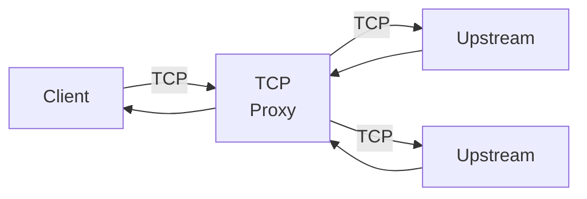
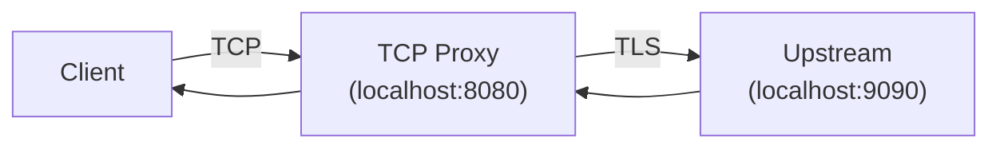

# TCPサーバ・TCPプロキシ

## 概要 {#abstract}

TCPサーバは、TCP(レイヤー4)のサーバを実装することを目的としています。
TCPサーバは、[Goの標準ライブラリ](https://pkg.go.dev/std)では提供されていません。
本機能では[net/httpパッケージ](https://pkg.go.dev/net/http)の[Server](https://pkg.go.dev/net/http#Server)に似たインターフェースでTCPサーバを利用できることを目指しています。

## 機能 {#features}

TCPサーバが保有する機能は以下の通りです。

### 1. TCPサーバ機能 {#tcp-server}

TCPサーバとして、クライアントからのTCP接続を受け付け、ハンドラーに処理を委譲します。
TCPサーバはTLSに対応しています。

- non-TLS TCPサーバ
- TLS TCPサーバ

サーバの終了処理は以下の２種類があります。

- クローズ
  - `Server.Close`を利用した終了処理
  - 最初にTCP接続の受付を停止（TCPリスナーのクローズ）
  - 続いて既存のTCPコネクションを全てクローズ
- シャットダウン
  - `Server.Shutdown`を利用した終了処理
  - 最初にTCP接続の受付を停止（TCPリスナーのクローズ）
  - 続いて既存のTCPコネクションが自然にクローズされるまで待機
  - シャットダウンタイムアウトが発生した際は残存するコネクションを残してシャットダウン処理を終了

TCPサーバのハンドラのインターフェースは以下のように定義され、
各クライアントのコネクションに対してそれぞれ独立したGoroutineで実行されます。

```go
type Handler interface {
	ServeTCP(ctx context.Context, conn net.Conn)
}
```

### 2. TCPサーバランナー {#tcp-server-runner}

TCPサーバランナーは、グレースフルシャットダウンを簡単に実装できる機能です。
サーバランナーを利用することでシャットダウン処理の実装の手間を省き、安全にサーバをシャットダウンできます。

利用例は[TCPサーバランナー](#tcp-server-runner-example)を参照してください。

### 3. TCPプロキシ機能 {#tcp-proxy}

TCPプロキシ機能は、TCPサーバのハンドラとして機能します。
クライアントのTCPコネクションから受け取ったパケットを別のTCPサーバへプロキシします。



転送先ダイアルについて、TCPプロキシはそれ自体が転送先サーバを決定する機能を持ちません。
かわりに、以下のような関数シグネチャのフィールドを公開することで、
具体的な転送先サーバの決定をユーザに委ねます。
TCPプロキシは、このDial関数を利用して転送先サーバを決定します。

```go
Dial func(ctx context.Context, dc net.Conn) (uc net.Conn, err error)
```

パッケージで用意されているプロキシの利用法は[デフォルトのプロキシ](#default-proxy)を参照ください。

## セキュリティに関する特記事項 {#security}

TCPサーバはTLSを利用可能です。
TLS機能はGo言語の標準機能をそのまま利用しています。

その他、TCPサーバとして特別考慮しているセキュリティはありません。

また、[znet](https://pkg.go.dev/github.com/aileron-projects/go/znet)パッケージの機能を用いることで以下のセキュリティ対策が可能です。

- 同時コネクション数制限 (実装例: [コネクション数制限](#connection-limiting))
- IPホワイトリスト (実装例: [IPホワイトリスト](#ip-whitelist))
- IPブラックリスト (実装例: [IPブラックリスト](#ip-blacklist))

## 性能に関する特記事項 {#performance}

性能面での特記事項はありません。

## 実装例・使い方 {#example}

### TCPサーバ {#tcp-server-example}

最も基本的なTCPサーバの実装は以下の通りです。
TLSは利用していません。
この実装例のハンドラは、受信したTCPデータを標準出力に出力するのみです。

```go
--8<-- "tcp/ex_basic/main.go"
```

### TCPサーバランナー {#tcp-server-runner-example}

TCPサーバランナーを利用すると、グレースフルシャットダウンを簡単に実現できます。
シャットダウンタイムアウトが発生した際には、既存のTCPコネクションのクローズ処理も実行してくれます。

TCPサーバランナーの実装例は以下の通りです。
`syscall`パッケージの利用が制限されているプラットフォームもある点に注意してください。

```go
--8<-- "tcp/ex_runner/main.go:32:53"
```

### TLS {#tls-server}

TLSを利用したTCPサーバの実装例は以下の通りです。
TLSサーバのcertファイルとkeyファイルのパスを指定するのみでも起動可能、より細かいTLSの設定をする場合は`Server.TLSConfig`を利用します。

```go
--8<-- "tcp/ex_tls/main.go:28:38"
```

### コネクション数制限 {#connection-limiting}

[znet](https://pkg.go.dev/github.com/aileron-projects/go/znet)パッケージの機能を利用して、
同時コネクション数を制限することが可能です。
実装例は以下となります。一部エラー処理は省略しています。

```go
--8<-- "tcp/ex_concurrency/main.go:29:43"
```

### IPホワイトリスト {#ip-whitelist}

[znet](https://pkg.go.dev/github.com/aileron-projects/go/znet)パッケージの機能を利用して、
ホワイトリスト形式で接続元IPを制限できます。
ホワイトリストは[トライ木](https://en.wikipedia.org/wiki/Trie)で実装されているため、IPアドレスの数が増えても処理時間の劣化はほとんどありません。
許可されないIPアドレスからの接続があった場合、TCPサーバは直ちに当該のTCPコネクションをクローズします。

なお、[znet](https://pkg.go.dev/github.com/aileron-projects/go/znet)パッケージを用いると、ホワイトリストの中でも一部だけは拒否する処理も可能です。

実装例は以下となります。一部エラー処理は省略しています。
この例では、ローカルホストである`127.0.0.1`と`::1`のIPアドレスのみ許可しています。

```go
--8<-- "tcp/ex_whitelist/main.go:29:43"
```

### IPブラックリスト {#ip-blacklist}

[znet](https://pkg.go.dev/github.com/aileron-projects/go/znet)パッケージの機能を利用して、
ブラックリスト形式で接続元IPを制限できます。
ブラックリストは[トライ木](https://en.wikipedia.org/wiki/Trie)で実装されているため、IPアドレスの数が増えても処理時間の劣化はほとんどありません。
許可されないIPアドレスからの接続があった場合、TCPサーバは直ちに当該のTCPコネクションをクローズします。

なお、[znet](https://pkg.go.dev/github.com/aileron-projects/go/znet)パッケージを用いると、ブラックリストの中でも一部だけは許可する処理も可能です。

実装例は以下となります。一部エラー処理は省略しています。
この例では、ローカルホストである`192.168.0.0/16`の範囲にあるIPアドレスを拒否しています。

```go
--8<-- "tcp/ex_blacklist/main.go:29:43"
```

### Unixドメインソケット {#unix-domain-socket}

TCPサーバは[Unixドメインソケット](https://en.wikipedia.org/wiki/Unix_domain_socket)を利用できます。

パス名ソケットを利用する場合は、以下のように指定します。

```go
--8<-- "tcp/ex_socket_path/main.go:28:39"
```

抽象ソケットを利用する場合は、以下のように指定します。

```go
--8<-- "tcp/ex_socket_abstract/main.go:28:39"
```

### デフォルトのプロキシ {#default-proxy}

[ztcp](https://pkg.go.dev/github.com/aileron-projects/go/znet/ztcp)パッケージは、デフォルトのプロキシ機能を提供します。
この機能を利用すると、複数の転送先サーバにに対してラウンドロビンによる負荷分散を利用しながらTCPをプロキシできます。

最も基本的なTCPプロキシの利用例は以下の通りです。
なお、グレースフルシャットダウンが必要な場合は、TCPサーバのサーバランナー機能を利用します。

この例では、TCPサーバをポート番号`8080`で待ち受け、`localhost:9090`のTCPサーバへプロキシしています。

```go
--8<-- "tcp/ex_proxy_basic/main.go"
```

### TLSによるプロキシ {#tls-proxy}

転送先サーバとの間でTLS通信を利用する場合、ユーザ自身で転送先サーバとのコネクションを確立する必要があります。
コネクションを確立する処理はDial関数に記述します。

以下が実装例になります。

```go
--8<-- "tcp/ex_proxy_tls/main.go"
```

この例はプロキシサーバと転送先サーバ間のみがTLSであり、クライアント側は非TLS通信になっています。
クライアント側もTLSにする場合はTCPサーバに対してTLSの設定を行います。

TLSパススルーを行う際は、通常のTCPプロキシのみで対応可能ですが、
`SNI (Server Name Indication)`を利用した負荷分散などを行う際は実装が必要です。



## 参考資料 {#reference}
