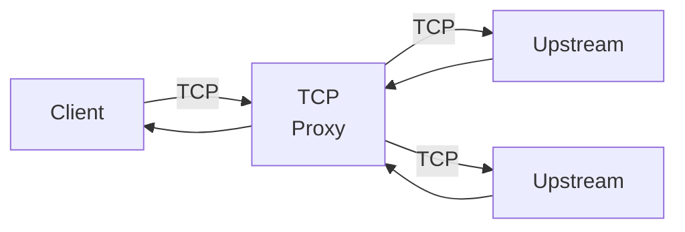
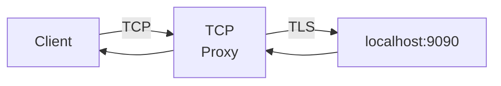

## 概要

TCPプロキシは、TCP通信をプロキシするレイヤー４プロキシです。
本機能はTCPサーバ上で動作します。

TCPサーバで利用可能な、以下の機能はそのまま利用できます。

- 同時コネクション数制限
- IPホワイトリスト
- IPブラックリスト

## 機能

TCPサーバが保有する機能は以下の通りです。

### 1. TCPプロキシ機能

TCPプロキシ機能は、TCPサーバのハンドラとして機能します。
クライアントのTCPコネクションから受け取ったパケットを別のTCPサーバへプロキシします。



### 2. 転送先サーバダイアル機能

TCPプロキシはそれ自体が転送先サーバを決定する機能を持りません。
かわりに、以下のような関数シグネチャのフィールドを公開することで、
具体的な転送先サーバの決定をユーザに委ねます。
TCPプロキシは、このDial関数を利用して転送先サーバを決定します。

```go
Dial func(ctx context.Context, dc net.Conn) (uc net.Conn, err error)
```

## セキュリティに関する特記事項

セキュリティに関する特記事項はありません。

## 性能に関する特記事項

性能に関する特記事項はありません。

## 実装例・使い方

### デフォルトのプロキシ

[ztcp](https://pkg.go.dev/github.com/aileron-projects/go/znet/ztcp)パッケージは、デフォルトのプロキシ機能を提供します。
この機能を利用すると、複数の転送先サーバにに対してラウンドロビンによる負荷分散を利用しながらTCPをプロキシできます。

最も基本的なTCPプロキシの利用例は以下の通りです。
なお、グレースフルシャットダウンが必要な場合は、TCPサーバのサーバランナー機能を利用します。

この例では、TCPサーバをポート番号`8080`で待ち受け、`localhost:9090`のTCPサーバへプロキシしています。

```go
{}
```

### TLSによるプロキシ

転送先サーバとの間でTLS通信を利用する場合、ユーザ自身で転送先サーバとのコネクションを確立する必要があります。
コネクションを確立する処理はDial関数に記述します。

以下が実装例になります。

{}

この実装例は、プロキシとプロキシ先サーバ間のみがTLSでありが、クライアント側は非TLS通信になっています。


