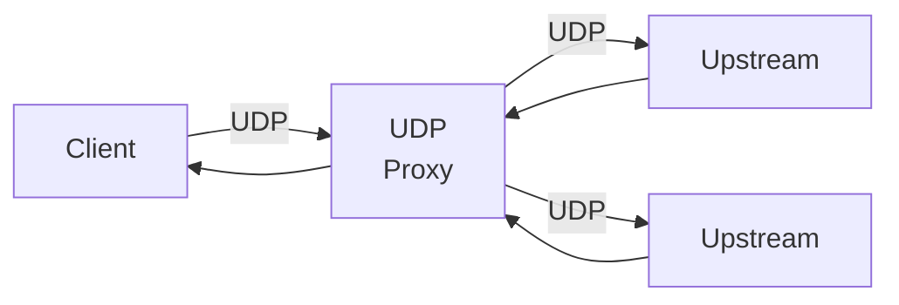
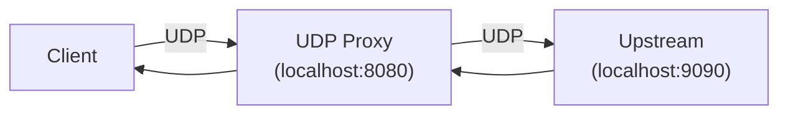

## 概要

UDPプロキシは、UDP通信をプロキシするレイヤー４プロキシです。
本機能はUDPサーバ上で動作します。

## 機能

UDPサーバが保有する機能は以下の通りです。

### 1. UDPプロキシ機能

UDPプロキシ機能は、UDPサーバのハンドラとして機能します。
クライアントのUDPコネクションから受け取ったパケットを別のUDPサーバへプロキシします。



### 2. 転送先ダイアル機能

TCPプロキシはそれ自体が転送先サーバを決定する機能を持ちません。
かわりに以下のような関数シグネチャのフィールドを公開することで、
具体的な転送先サーバの決定をユーザに委ねます。
UDPプロキシは、このDial関数を利用して転送先サーバを決定します。
なお、第二引数の`Conn`は特定の`IP:Port`を持つクライアントとの仮想コネクションです。

```go
Dial func(ctx context.Context, dc Conn) (uc net.Conn, err error)
```

## セキュリティに関する特記事項

セキュリティに関する特記事項はありません。

## 性能に関する特記事項

性能に関する特記事項はありません。

## 実装例・使い方

### デフォルトのプロキシ

[zudp](https://pkg.go.dev/github.com/aileron-projects/go/znet/zudp)パッケージは、デフォルトのプロキシ機能を提供します。
この機能を利用すると、複数の転送先サーバにに対してラウンドロビンによる負荷分散を利用しながらUDPをプロキシできます。

最も基本的なUDPプロキシの利用例は以下の通りです。
なお、グレースフルシャットダウンが必要な場合は、UDPサーバのサーバランナー機能を利用します。

この例では、UDPサーバをポート番号`8080`で待ち受け、`localhost:9090`のUDPサーバへプロキシしています。



```go
{}
```

## 参考資料
